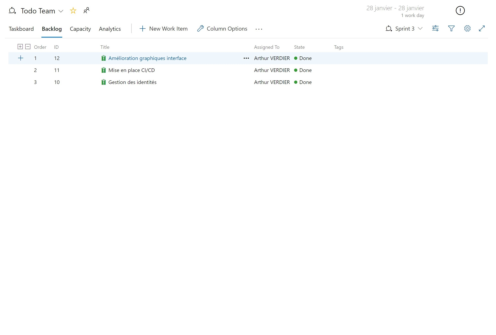

# Enigma | Scrum | Todo frontend

[](https://app.netlify.com/sites/enigma-scrum-todo/deploys)

## Project setup
```
npm install
```

### Compiles and hot-reloads for development
```
npm run serve
```

### Compiles and minifies for production
```
npm run build
```

### Lints and fixes files
```
npm run lint
```

### Customize configuration
See [Configuration Reference](https://cli.vuejs.org/config/).

## Sprint

## Sprint 01


## Sprint 02


## Sprint 03




